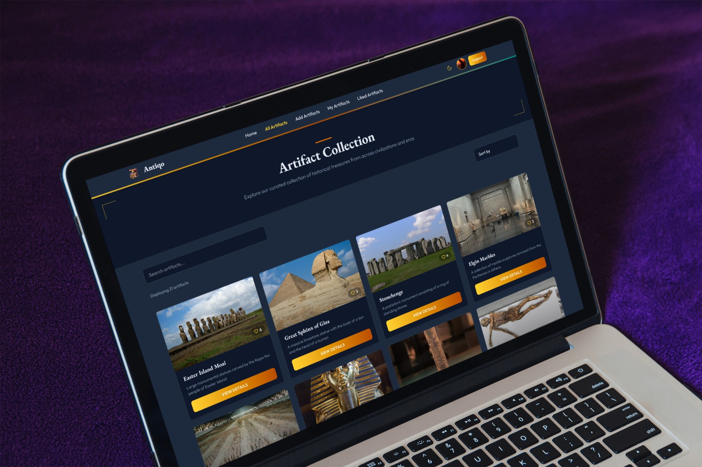

<div align="center">
  
</div>


# Antiqo - Historical Artifacts Tracker

## Project Overview
Antiqo is a dynamic web application designed for historical artifact enthusiasts, historians, and researchers. It provides a user-friendly platform to browse, contribute, and manage a diverse collection of historical artifacts. Users can explore cultural treasures, like and track their favorite items, and contribute new artifacts with real-time feedback. Built with a responsive design and secure backend, Antiqo ensures an engaging and seamless experience across devices, making history accessible and interactive.

## Features
Antiqo offers a rich set of features to enhance user interaction and artifact management:

#### Authentication


- Secure Login: Email/password and social login (Google, GitHub) with JWT-based authentication.


- Protected Routes: Restrict access to user-specific features like liking and contributing artifacts.

#### Artifact Management


- Browse Artifacts: View a curated collection with details like historical context, category, and discovery date.


- Add Artifacts: Users can submit new artifacts with images and metadata.


- Update/Delete: Authorized users can edit or remove their contributions.


- Category-Based Suggestions: View similar artifacts by category (e.g., Tools, Pottery) on artifact details pages.

#### User Interaction


- Like Artifacts: Users can like artifacts, with real-time like count updates.


- Track Contributions: View liked and submitted artifacts in user profiles.


- Responsive Pagination: Browse artifacts with pagination (8 per page) for efficient navigation.

#### Search & Filter


- Search by Name: Quickly find artifacts using a search bar.


- Sort by Likes: Filter artifacts by ascending or descending like counts.


- Category Filtering: Explore artifacts by specific categories (planned enhancement).

#### User Experience


- Responsive Design: Optimized for mobile, tablet, and desktop with Tailwind CSS.


- Dynamic UI: Animated transitions (Framer Motion), loading spinners, and toast notifications.


- Custom 404 Page: Friendly error page for invalid routes.


- SEO-Friendly: Dynamic page titles with react-helmet.

- Security & Performance


- Environment Variables: Secure configuration for Firebase, MongoDB, and JWT.


- Real-Time Feedback: Instant updates for likes, submissions, and errors.


- Efficient Data Fetching: Optimized API calls with Axios.

### Live Links & Resources
- **[Live Site](https://antiqo-tracker.web.app/)**
- **[Client Repository](https://github.com/ornobaadi/Antiqo-Tracker-Client)**
- **[Server Repository](https://github.com/ornobaadi/Antiqo-Tracker-Server)**

## Technologies Used
- **Frontend**: React, Tailwind CSS, Flowbite, Framer Motion
- **Backend**: Node.js, Express.js, MongoDB, JWT
- **Hosting**: Firebase (Frontend), Vercel (Backend)


### Core Features
1. **User Authentication**: Email/password and Google/GitHub login, with protected routes.
2. **Responsive Design**: Optimized for mobile, tablet, and desktop.
3. **Artifact Management**: Add, update, and delete artifacts with real-time feedback.
4. **User Interaction**: Like artifacts, track liked items, and view contributions.
5. **Search & Filter**: Search artifacts by name and display featured items.
6. **Enhanced UX**: Dynamic titles, 404 page, loading spinners, and toast notifications.
7. **Secure Configuration**: Environment variables for Firebase and MongoDB.

### Dependencies
- react-router-dom
- tailwindcss
- daisyui
- framer-motion
- react-toastify
- axios
- jsonwebtoken
- dotenv

### How to Run Locally
1. **Clone the repositories:**
   ```bash
   git clone https://github.com/ornobaadi/Antiqo-Tracker-Client.git
   git clone https://github.com/ornobaadi/Antiqo-Tracker-Server.git
   ```
2. **Navigate to each directory and install dependencies:**
   ```bash
   cd Antiqo-Tracker-Client
   npm install
   
   cd ../Antiqo-Tracker-Server
   npm install
   ```
3. **Set up environment variables:**
   - Create a `.env` file in both `client` and `server` directories with the required firebase and MongoURI config keys.
4. **Run the applications:**
   ```bash
   cd Antiqo-Tracker-Client
   npm run dev
   
   cd ../Antiqo-Tracker-Server
   nodemon index.js
   ```
5. **Visit the frontend:** Open `http://localhost:5173` in your browser.


## ✨ Author

Developed by **[Abu Jafar Md. Fajlay Rabby](https://www.linkedin.com/in/ornobaadi/)**  
📁 [Portfolio](https://ornobaadi-1.web.app/)  
🐙 [GitHub](https://github.com/ornobaadi)

---


